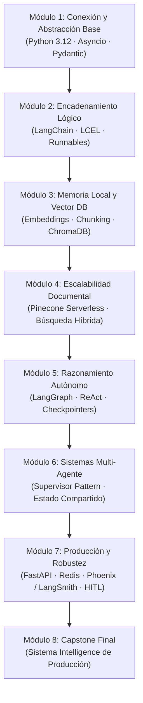

---
tags:
  - moc
  - ai-engineering
  - index
aliases:
  - Home
  - Indice General
created: 2026-09-04
---

# 🧠 AI Engineering & Architecture — Map of Content (MOC)

Bienvenido a la bóveda de notas para el programa **AI Engineering / AI Architect**. Esta base de conocimiento está organizada por módulos progresivos, diseñada para estudiar la teoría, dominar el código y preparar cada una de las pre-entregas hasta el proyecto Capstone final.

> [!TIP]
> En Obsidian puedes abrir la **Graph View** (`Ctrl + G`) para visualizar cómo se conectan los conceptos de clientes asíncronos, cadenas LCEL, bases vectoriales, grafos de agentes y despliegue en producción.

---

## 🗺️ Arquitectura de Aprendizaje

---

## 📂 Navegación por Módulos

### 🔌 Módulo 1: La Interfaz Base — Conexión y Abstracción de LLMs
* [[01 - Modulo 1 - Abstraccion y Clientes Asincronos/1.1 - Concurrencia y Asyncio en Python 3.12|1.1 Concurrencia y Asyncio en Python 3.12]]
* [[01 - Modulo 1 - Abstraccion y Clientes Asincronos/1.2 - Abstraccion de Clientes y Patron Factory|1.2 Abstracción de Clientes y Patrón Factory]]
* [[01 - Modulo 1 - Abstraccion y Clientes Asincronos/1.3 - Validacion y Seguridad con Pydantic|1.3 Validación y Seguridad con Pydantic v2]]
* [[01 - Modulo 1 - Abstraccion y Clientes Asincronos/1.4 - Guia y Rubrica Pre-entrega 1|1.4 Guía y Rúbrica: Pre-entrega 1 (Unified Async Client)]]

### 🔗 Módulo 2: Encadenamiento Lógico — Orquestación con LangChain
* [[02 - Modulo 2 - Orquestacion con LangChain y LCEL/2.1 - LCEL y Protocolo Runnable|2.1 LCEL y el Protocolo Runnable]]
* [[02 - Modulo 2 - Orquestacion con LangChain y LCEL/2.2 - Salidas Estructuradas y Resiliencia|2.2 Salidas Estructuradas y Resiliencia en Cadenas]]
* [[02 - Modulo 2 - Orquestacion con LangChain y LCEL/2.3 - Guia y Rubrica Pre-entrega 2|2.3 Guía y Rúbrica: Pre-entrega 2 (Pipeline Validado)]]

### 💾 Módulo 3: Persistencia de Datos y Vector DBs Locales
* [[03 - Modulo 3 - Embeddings y ChromaDB Local/3.1 - Embeddings y Similitud Semantica|3.1 Embeddings y la Geometría de la Similitud]]
* [[03 - Modulo 3 - Embeddings y ChromaDB Local/3.2 - Chunking y Preprocesamiento|3.2 Estrategias de Chunking y Preprocesamiento]]
* [[03 - Modulo 3 - Embeddings y ChromaDB Local/3.3 - ChromaDB Local y Operaciones CRUD|3.3 ChromaDB Local y Operaciones CRUD]]
* [[03 - Modulo 3 - Embeddings y ChromaDB Local/3.4 - Guia y Rubrica Pre-entrega 3|3.4 Guía y Rúbrica: Pre-entrega 3 (RAG Local)]]

### ☁️ Módulo 4: Escalabilidad Documental — RAG Avanzado y Pinecone
* [[04 - Modulo 4 - RAG Avanzado y Pinecone Cloud/4.1 - Pinecone Serverless y Metadata Ingestion|4.1 Pinecone Serverless, Ingesta Batch y Namespaces]]
* [[04 - Modulo 4 - RAG Avanzado y Pinecone Cloud/4.2 - Busqueda Hibrida y Metricas de Evaluacion|4.2 Búsqueda Híbrida (BM25 + Dense) y Métricas (Precision@k, Recall@k)]]
* [[04 - Modulo 4 - RAG Avanzado y Pinecone Cloud/4.3 - Guia y Rubrica Pre-entrega 4|4.3 Guía y Rúbrica: Pre-entrega 4 (RAG Cloud Escalable)]]

### 🤖 Módulo 5: Razonamiento Autónomo — Introducción a Agentes con LangGraph
* [[05 - Modulo 5 - Agentes con LangGraph/5.1 - Fundamentos de LangGraph (State, Nodos, Aristas)|5.1 Fundamentos de LangGraph: Estados, Nodos y Aristas]]
* [[05 - Modulo 5 - Agentes con LangGraph/5.2 - Tool Calling y Ciclo ReAct|5.2 Tool Calling Seguro y el Ciclo ReAct]]
* [[05 - Modulo 5 - Agentes con LangGraph/5.3 - Persistencia y Guia Pre-entrega 5|5.3 Checkpointers (SqliteSaver) y Guía Pre-entrega 5]]

### 👥 Módulo 6: Sistemas Multi-Agente — Colaboración y Especialización
* [[06 - Modulo 6 - Sistemas Multi-Agente/6.1 - Topologias y Patron Supervisor|6.1 Topologías Multi-Agente y el Patrón Supervisor]]
* [[06 - Modulo 6 - Sistemas Multi-Agente/6.2 - Guia y Rubrica Pre-entrega 6|6.2 Estado Compartido y Guía Pre-entrega 6]]

### 🛡️ Módulo 7: Producción y Robustez — Observabilidad, Costos y Despliegue
* [[07 - Modulo 7 - Observabilidad y Produccion/7.1 - Observabilidad (Phoenix y LangSmith)|7.1 Observabilidad, Trazado (Spans) y Evals en RAG]]
* [[07 - Modulo 7 - Observabilidad y Produccion/7.2 - FastAPI, Redis y HITL (Pre-entrega 7)|7.2 FastAPI Asíncrono, Colas en Redis y Human-in-the-Loop]]

### 🏆 Módulo 8: Capstone Project — Sistema Intelligence de Grado de Producción
* [[08 - Modulo 8 - Capstone/8.1 - Capstone Final Architecture|8.1 Especificación del Capstone y Rúbrica Final]]

### 📚 Recursos de Referencia
* [[99 - Recursos/Glosario y Conceptos Clave|Glosario de Términos Clave]]
* [[99 - Recursos/Preguntas Frecuentes y Repaso|Preguntas Frecuentes y Cheat Sheet de Exámenes]]
