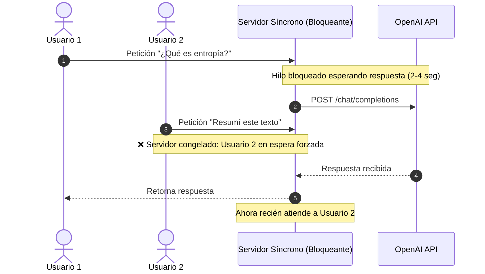

---
tags:
  - modulo-1
  - python-3-12
  - asyncio
  - concurrencia
  - streaming
aliases:
  - Asyncio en Python 3.12
  - Concurrencia Asíncrona
created: 2026-09-04
---

# 1.1 Concurrencia y Asyncio en Python 3.12

## 🎯 Objetivo de la Unidad
Comprender la arquitectura no bloqueante en Python 3.12 para optimizar la interacción con Large Language Models (LLMs) y construir sistemas de IA escalables con bajo *Time to First Token* (TTFT).

---

## 1. El Porqué del Asincronismo en Ingeniería de IA

En desarrollo tradicional, una tarea suele ser **CPU-bound** (cálculos matemáticos, compresión, etc.). Sin embargo, en aplicaciones con LLMs:
* **El 90% del tiempo se pasa esperando**: La computadora envía un prompt a la API de OpenAI/Anthropic y espera a que los servidores remotos procesen los tokens y los devuelvan por la red.
* Se trata de una tarea estrictamente **I/O-bound** (Input/Output de red).



### La Solución: Concurrencia Cooperativa con `asyncio`
Con `asyncio`, un único hilo principal puede gestionar cientos de conexiones concurrentes: mientras espera que la API de OpenAI devuelva un token, **cede el control** para atender a otros usuarios, consultar una base vectorial o procesar un webhook.

---

## 2. Anatomía de `asyncio`

### A. Corrutinas (`async def` y `await`)
Una corrutina es una función que puede pausar su ejecución en puntos designados con `await` sin bloquear el hilo principal.

```python
async def fetch_llm_response(prompt: str) -> str:
    # La ejecución se pausa aquí, liberando el hilo para otras tareas
    response = await client.chat.completions.create(
        model="gpt-4o-mini",
        messages=[{"role": "user", "content": prompt}]
    )
    return response.choices[0].message.content
```

### B. El Event Loop (El Gestor del Restaurante)
El Event Loop es el motor central que orquesta las corrutinas:
* Recibe peticiones (Tareas).
* Si un camarero (hilo) está esperando que la cocina (API externa) entregue un plato, el Event Loop le asigna de inmediato atender otra mesa.

### C. Tasks (Tareas en Segundo Plano)
Una corrutina por sí sola no hace nada hasta que se la invoca con `await` o se programa en el loop como un `asyncio.Task`:
```python
task = asyncio.create_task(mi_corrutina())
```

---

## 3. Patrones Modernos en Python 3.12

Python 3.12 depuró la API de `asyncio` eliminando patrones antiguos y ambiguos (como invocar manualmente `get_event_loop()` fuera de contexto).

### Reglas de Oro en Python 3.12:
1. **Punto de entrada único**: Usar siempre `asyncio.run(main())`. Se encarga de crear el loop, ejecutar la corrutina principal, cancelar tareas pendientes y cerrar los ejecutores limpiamente.
2. **Acceso al loop activo**: Usar `asyncio.get_running_loop()` en lugar de `get_event_loop()`.
3. **Manejo seguro de concurrencia**: `asyncio.TaskGroup()` (introducido en 3.11 y perfeccionado en 3.12) para que si una tarea falla, el grupo cancele las demás de forma determinista.

---

## 4. Control de Latencia y Flujo

### A. Concurrencia con `asyncio.gather`
Permite disparar múltiples corrutinas a la vez y esperar a que todas terminen:

```python
async def compare_models(prompt: str):
    results = await asyncio.gather(
        call_openai(prompt),
        call_anthropic(prompt),
        call_gemini(prompt),
        return_exceptions=True  # ⚠️ CRUCIAL: si uno falla, no tumba a los demás
    )
    return results
```

### B. Timeouts con `asyncio.timeout`
Las APIs externas pueden experimentar latencias infinitas o cuelgues. Un timeout previene la retención indefinida de recursos:

```python
try:
    async with asyncio.timeout(5.0): # 5 segundos de límite
        response = await call_llm(prompt)
except TimeoutError:
    print("El modelo tardó demasiado. Ejecutando fallback...")
```

### C. Semáforos (`asyncio.Semaphore`): Prevención del Error 429
Si disparas 1.000 llamadas concurrentes con `gather`, el proveedor responderá con un error `429 Too Many Requests`. El semáforo actúa como un portero:

```python
sem = asyncio.Semaphore(5)  # Máximo 5 llamadas en paralelo

async def throttled_call(prompt: str):
    async with sem:
        return await call_llm(prompt)
```

---

## 5. Anti-patrones Críticos a Evitar

> [!CAUTION]
> **Anti-patrón 1: Bloquear el Event Loop**
> Nunca ejecutes código síncrono bloqueante (como `time.sleep()`, `requests.get()` o procesamiento de CPU intensivo) dentro de una función `async def`. Congelarás el Event Loop completo para todos los usuarios.
>
> **Solución**: Si necesitas llamar a una librería síncrona heredada, delega la ejecución a un worker thread con:
> ```python
> result = await asyncio.to_thread(libreria_sincrona_pesada, data)
> ```

> [!WARNING]
> **Anti-patrón 2: Confundir Asincronía con Paralelismo Multiproceso**
> `asyncio` no acelera cálculos matemáticos locales de PyTorch o transformaciones masivas de Pandas. Asyncio es exclusivamente para I/O de red y sockets.

---

## 6. Streaming de Tokens y Generadores Asíncronos

El streaming reduce drásticamente el **Time to First Token (TTFT)**. En lugar de esperar 4 segundos a que el LLM termine los 500 tokens, el primer token se muestra en 200 ms.

Se implementa mediante generadores asíncronos (`AsyncGenerator` y `yield`):
```python
from typing import AsyncGenerator

async def stream_tokens(client, prompt: str) -> AsyncGenerator[str, None]:
    stream = await client.chat.completions.create(
        model="gpt-4o-mini",
        messages=[{"role": "user", "content": prompt}],
        stream=True
    )
    async for chunk in stream:
        delta = chunk.choices[0].delta.content
        if delta:
            yield delta
```

---

## 📝 Preguntas de Autoevaluación
1. ¿Por qué `asyncio` es ideal para llamadas a APIs de LLMs pero no para entrenar redes neuronales en tu CPU?
2. ¿Qué diferencia práctica existe entre `await asyncio.sleep(2)` y `time.sleep(2)` dentro de una corrutina?
3. ¿Para qué se usa el parámetro `return_exceptions=True` en `asyncio.gather`?
