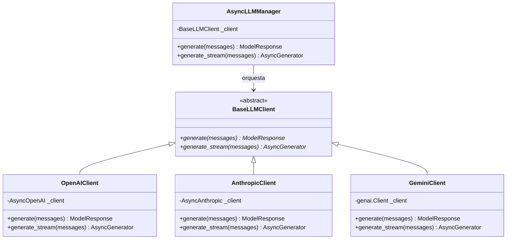

---
tags:
  - modulo-1
  - patrones-de-diseno
  - factory-pattern
  - oop
  - abstraccion
aliases:
  - Abstracción de Clientes
  - Factory Pattern LLM
created: 2026-09-04
---

# 1.2 Abstracción de Clientes y Patrón Factory

## 🎯 Objetivo de la Unidad
Diseñar una capa de abstracción desacoplada para interactuar con múltiples proveedores de modelos fundacionales (OpenAI, Anthropic, Gemini) garantizando sustituibilidad, facilidad de testing e interfaces consistentes.

---

## 1. El Problema del Acoplamiento Directo

Muchos proyectos de IA cometen el error de instanciar clientes de OpenAI directamente dentro de las rutas de su API o en la lógica de negocio:

```python
# ❌ CÓDIGO ACOPLADO (Mala práctica)
async def responder_usuario(texto: str):
    client = AsyncOpenAI()
    res = await client.chat.completions.create(
        model="gpt-4o",
        messages=[{"role": "user", "content": texto}]
    )
    return res.choices[0].message.content  # Atado exclusivamente a OpenAI
```

### Problemas Graves de este Enfoque:
1. **Vendor Lock-in**: Cambiar a Claude 3.5 o Gemini exige modificar decenas de archivos.
2. **Firmas Incompatibles**:
   * OpenAI devuelve `res.choices[0].message.content`.
   * Anthropic devuelve `res.content[0].text`.
   * Gemini devuelve `res.text`.
3. **Dificultad de Testing**: Es casi imposible hacer mocks para tests unitarios sin levantar credenciales reales.

---

## 2. La Solución Arquitectónica: Contrato Base (`ABC`)

Definimos una clase base abstracta (`BaseLLMClient`) utilizando el módulo `abc` de Python. Esta clase establece el contrato formal que todo proveedor debe implementar obligatoriamente.



### Implementación del Contrato Base:
```python
from abc import ABC, abstractmethod
from typing import AsyncGenerator, List
from schemas import ChatMessage, ModelResponse

class BaseLLMClient(ABC):
    """Contrato que todo cliente de LLM debe cumplir obligatoriamente."""

    @abstractmethod
    async def generate(self, messages: List[ChatMessage]) -> ModelResponse:
        """Genera una respuesta completa en modo normal."""
        raise NotImplementedError

    @abstractmethod
    async def generate_stream(self, messages: List[ChatMessage]) -> AsyncGenerator[str, None]:
        """Genera la respuesta token a token en modo streaming."""
        raise NotImplementedError
        yield
```

---

## 3. Matriz Comparativa de Proveedores

| Característica | OpenAI | Anthropic | Google Gemini |
| :--- | :--- | :--- | :--- |
| **SDK Asíncrono** | `AsyncOpenAI` | `AsyncAnthropic` | `genai.Client(...).aio` |
| **Método de llamada** | `client.chat.completions.create` | `client.messages.create` | `client.aio.models.generate_content` |
| **Ubicación del Texto** | `response.choices[0].message.content` | `response.content[0].text` | `response.text` |
| **Streaming** | `stream=True` + `async for` | `client.messages.stream(...)` (context manager) | `generate_content_stream(...)` + `async for` |
| **System Prompt** | Mensaje con `role="system"` | Parámetro `system` independiente | `system_instruction` en config |
| **Rol del Asistente**| `"assistant"` | `"assistant"` | `"model"` |

---

## 4. El Patrón Factory (`AsyncLLMManager`)

El *Factory Pattern* centraliza la instanciación. La aplicación nunca crea un `OpenAIClient` a mano; en su lugar, le pide al `AsyncLLMManager` que resuelva el cliente basándose en la configuración (`LLMConfig`).

```python
class AsyncLLMManager:
    def __init__(self, config: LLMConfig):
        self.config = config
        self._client: BaseLLMClient = self._crear_cliente()

    def _crear_cliente(self) -> BaseLLMClient:
        if self.config.provider == Provider.OPENAI:
            return OpenAIClient(
                api_key=self.config.openai_api_key.get_secret_value(),
                model=self.config.model,
                temperature=self.config.temperature,
                max_tokens=self.config.max_tokens,
            )
        elif self.config.provider == Provider.ANTHROPIC:
            return AnthropicClient(
                api_key=self.config.anthropic_api_key.get_secret_value(),
                model=self.config.model,
                temperature=self.config.temperature,
                max_tokens=self.config.max_tokens,
            )
        elif self.config.provider == Provider.GEMINI:
            return GeminiClient(
                api_key=self.config.google_api_key.get_secret_value(),
                model=self.config.model,
                temperature=self.config.temperature,
                max_tokens=self.config.max_tokens,
            )
        raise ValueError(f"Proveedor no soportado: {self.config.provider}")

    async def generate(self, messages: List[ChatMessage]) -> ModelResponse:
        return await self._client.generate(messages)

    async def generate_stream(self, messages: List[ChatMessage]) -> AsyncGenerator[str, None]:
        async for chunk in self._client.generate_stream(messages):
            yield chunk
```

---

## 5. Resiliencia y Captura Estructurada de Excepciones

> [!IMPORTANT]
> **Fuga de Excepciones (Exception Leakage)**:
> Si la API de OpenAI responde con un `RateLimitError` o se cae la conexión de red, **la excepción nunca debe escapar al hilo principal** tumbando el servidor.
> Debe ser interceptada en el cliente y empaquetada en el objeto `ModelResponse(error=...)`.

```python
try:
    # llamada al SDK...
except OpenAIRateLimitError as e:
    return ModelResponse(provider=Provider.OPENAI, model=self.model, content="", error=f"Cuota excedida: {e}")
except OpenAIConnectionError as e:
    return ModelResponse(provider=Provider.OPENAI, model=self.model, content="", error=f"Error de red: {e}")
except OpenAIAPIError as e:
    return ModelResponse(provider=Provider.OPENAI, model=self.model, content="", error=f"Fallo en API: {e}")
```

---

## 📝 Preguntas de Autoevaluación
1. ¿Qué beneficio aporta que `BaseLLMClient` herede de `ABC` y decore sus métodos con `@abstractmethod`?
2. ¿Por qué Anthropic falla si omites el parámetro `max_tokens` y cómo abstrae eso tu cliente?
3. ¿Cómo evita el patrón Factory que un cambio de proveedor requiera modificar la lógica de negocio?
