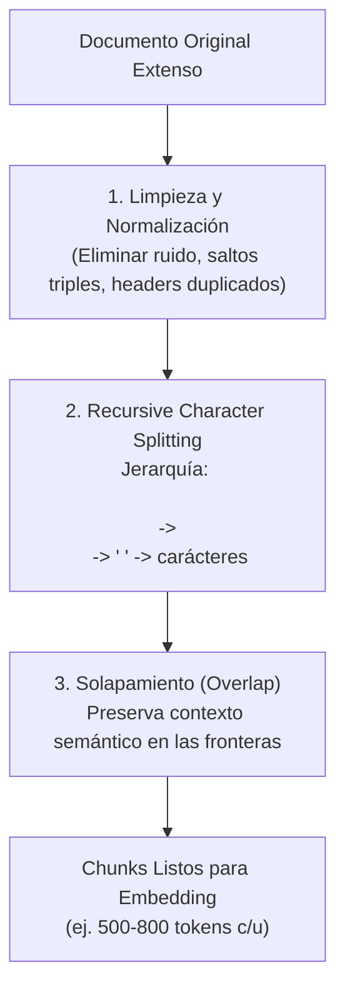

---
tags:
  - modulo-3
  - chunking
  - text-splitting
  - preprocesamiento
  - rag
aliases:
  - Estrategias de Chunking
  - Preprocesamiento de Documentos
created: 2026-09-04
---

# 3.2 Estrategias de Chunking y Preprocesamiento

## 🎯 Objetivo de la Unidad
Diseñar pipelines de ingesta que limpien el texto y apliquen fragmentación semántica (*chunking*) equilibrada para maximizar la calidad de recuperación en arquitecturas RAG.

---

## 1. ¿Por qué Fragmentar (Chunking)?

1. **Dilución Semántica**: Si conviertes un PDF de 80 páginas en un único embedding, el vector resultante será un promedio matemático tan difuso que será incapaz de responder preguntas puntuales.
2. **Límites de Contexto**: Los modelos de embedding y los LLMs tienen ventanas de contexto finitas y cobran por tokens consumidos.
3. **Precisión Quirúrgica**: El objetivo es generar unidades de información **atómicas y autocontenidas**.

---

## 2. Estrategias de Chunking

### A. Fixed-Size (Tamaño Fijo)
Corta cada $N$ caracteres o tokens. Es arriesgado porque suele partir oraciones o definiciones clave por la mitad.

### B. Recursive Character Text Splitting (Estándar de la Industria)
Intenta dividir el texto respetando la estructura natural del documento mediante una jerarquía de separadores:
1. Párrafos (`

`)
2. Saltos de línea (`
`)
3. Espacios en blanco (` `)
4. Caracteres individuales (último recurso)

### C. Solapamiento (Chunk Overlap)
Permite que el final de un chunk se repita al inicio del siguiente (ej. 500 tokens por chunk con 50 tokens de overlap).
* **Motivación**: Si una idea clave o una excepción legal queda justo en el corte, el overlap garantiza que el contexto no se pierda en ninguno de los dos fragmentos.

---

## 3. Anti-patrones de Chunking
* **Chunks microscópicos (< 50 tokens)**: Pierden el contexto global; el LLM no entiende a qué sujeto se refieren los pronombres.
* **Chunks gigantescos (> 2000 tokens)**: Diluyen el embedding y sobrecargan la ventana de contexto del LLM ("Lost in the Middle").
* **Medir en caracteres en vez de tokens**: Los límites de los modelos se rigen por tokens (usar herramientas como `tiktoken`).
