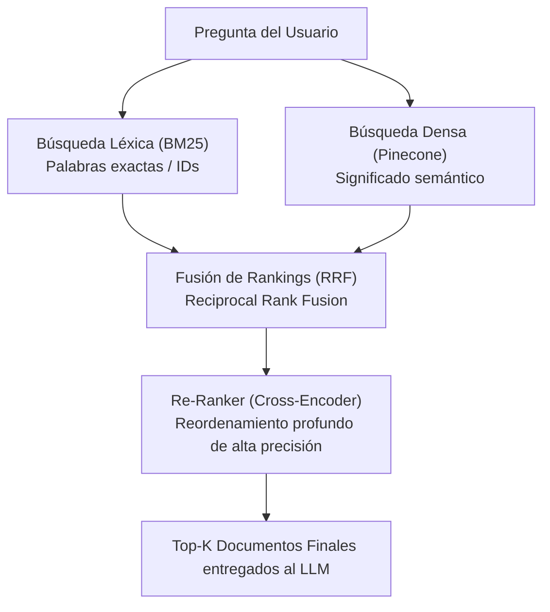

---
tags:
  - modulo-4
  - busqueda-hibrida
  - bm25
  - rrf
  - re-ranking
  - metricas
aliases:
  - Búsqueda Híbrida y RRF
  - Métricas de Recuperación RAG
created: 2026-09-04
---

# 4.2 Búsqueda Híbrida (BM25 + Dense) y Métricas

## 🎯 Objetivo de la Unidad
Superar las limitaciones de la búsqueda semántica pura combinándola con búsqueda léxica (BM25) mediante Reciprocal Rank Fusion (RRF), re-ranking con cross-encoders y evaluación cuantitativa mediante Precision@k y Recall@k.

---

## 1. La Búsqueda Híbrida: Lo Mejor de Dos Mundos

* **Búsqueda Densa (Embeddings)**: Excelente para capturar conceptos, sinónimos y la intención general del usuario. Falla ante números de serie, acrónimos o términos técnicos raros.
* **Búsqueda Léxica (BM25)**: Búsqueda tradicional por palabras clave exactas. Falla ante sinónimos o lenguaje indirecto.
* **Búsqueda Híbrida**: Ejecuta ambas y fusiona los resultados.

---

## 2. Reciprocal Rank Fusion (RRF)

> [!WARNING]
> Nunca sumes directamente el score de BM25 con el de Similitud Coseno (ej. un score BM25 de 18.5 no tiene relación con un coseno de 0.82). Se deben combinar mediante su **posición en el ranking** con RRF:

$$RRF\_Score(d) = \sum_{m \in M} rac{1}{k + r_m(d)}$$
donde $r_m(d)$ es la posición del documento en el ranking del método $m$ y $k$ es una constante (usualmente 60).

---

## 3. Re-Ranking con Cross-Encoders

* **Bi-Encoders (Embeddings)**: Procesan query y documento por separado. Rápido para buscar en millones de registros, pero menos preciso.
* **Cross-Encoders (Re-rankers como Cohere)**: Procesan query y documento juntos (`[CLS] query [SEP] doc [SEP]`). Altísima precisión en interacciones complejas. Se aplica solo a los candidatos finalistas (top 20) para devolver el mejor top 5.

---

## 4. Métricas de Evaluación Cuantitativa

Para evaluar si el retriever funciona, usamos un **Golden Set** (preguntas de prueba con los documentos esperados identificados):

| Métrica | Definición | Por qué es crítica en RAG |
| :--- | :--- | :--- |
| **Precision@k** | Proporción de documentos recuperados en el top-$k$ que son realmente relevantes. | Si es baja, introducimos ruido y distraemos al LLM. |
| **Recall@k** | Proporción de todos los documentos relevantes que lograron entrar en el top-$k$. | Si es bajo, el LLM no tiene el contexto para responder y alucina. |
| **F1-Score** | Media armónica entre Precision y Recall. | Balance general del sistema de recuperación. |
