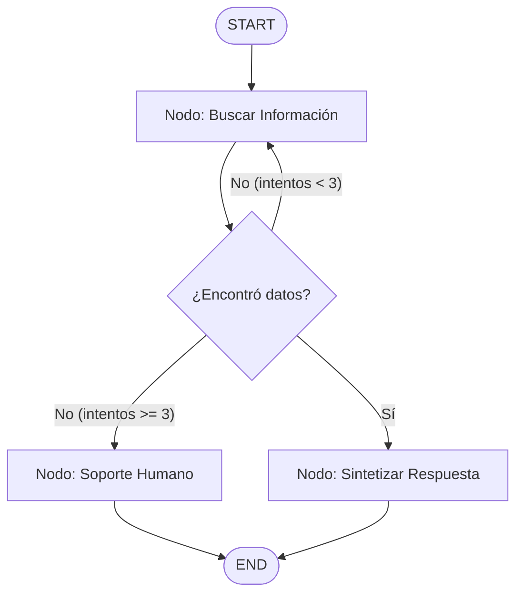

---
tags:
  - modulo-5
  - langgraph
  - agentes
  - stategraph
  - reducers
aliases:
  - Fundamentos de LangGraph
  - Grafos de Estado
created: 2026-09-04
---

# 5.1 Fundamentos de LangGraph: Estados, Nodos y Aristas

## 🎯 Objetivo de la Unidad
Comprender la transición de cadenas lineales acíclicas (DAGs) hacia **Grafos de Estado Cíclicos** con LangGraph, permitiendo que los agentes razonen en bucle, corrijan sus propios errores y mantengan una memoria de trabajo estructurada.

---

## 1. El Salto de Cadenas (LCEL) a Grafos (LangGraph)

* **Cadenas LCEL**: Ideales para flujos deterministas en línea recta: $A 
ightarrow B 
ightarrow C$. Si el paso $B$ falla o necesita corrección, la cadena entera se rompe.
* **Grafos de Estado (LangGraph)**: Permiten **ciclos** de razonamiento: si un resultado es insatisfactorio o una herramienta devuelve un error, el flujo puede volver a un nodo anterior para reintentar o reflexionar.



---

## 2. Los 4 Pilares Fundamentales de LangGraph

### A. El Estado (State) — La Cinta Transportadora
Es la memoria compartida que fluye a través de todos los nodos. En Python 3.12 se define mediante `TypedDict`:

```python
from typing import Annotated, TypedDict, List
from langchain_core.messages import BaseMessage
from langgraph.graph.message import add_messages

class AgentState(TypedDict):
    # 'add_messages' es el REDUCER: acumula mensajes sin sobrescribir la lista
    messages: Annotated[List[BaseMessage], add_messages]
    intentos: int
    caso_resuelto: bool
```

> [!IMPORTANT]
> **El Concepto de Reducers**:
> Por defecto en `TypedDict`, si un nodo devuelve `{"intentos": 2}`, actualiza solo esa clave. Pero en listas (como el historial de chat), si no usas un reducer, el nuevo mensaje borraría toda la conversación previa. `add_messages` concatena los nuevos mensajes automáticamente.

### B. Los Nodos (Nodes) — Las Estaciones de Trabajo
Son funciones de Python (síncronas o `async`) que reciben el estado actual y devuelven un diccionario con las modificaciones parciales:

```python
async def llamar_modelo(state: AgentState) -> dict:
    respuesta = await modelo.ainvoke(state["messages"])
    return {"messages": [respuesta]}
```

### C. Las Aristas (Edges) — El Control de Tráfico
* **Aristas Directas**: `workflow.add_edge("nodo_a", "nodo_b")` (transición garantizada).
* **Aristas Condicionales**: `workflow.add_conditional_edges("nodo_a", funcion_decisora, mapping)`. La función decisora inspecciona el estado y devuelve el nombre del siguiente camino a seguir.

### D. Compilación del Grafo (`workflow.compile()`)
Valida que exista un punto de entrada `START`, que no haya nodos huérfanos y que todos los caminos alcancen `END`.
