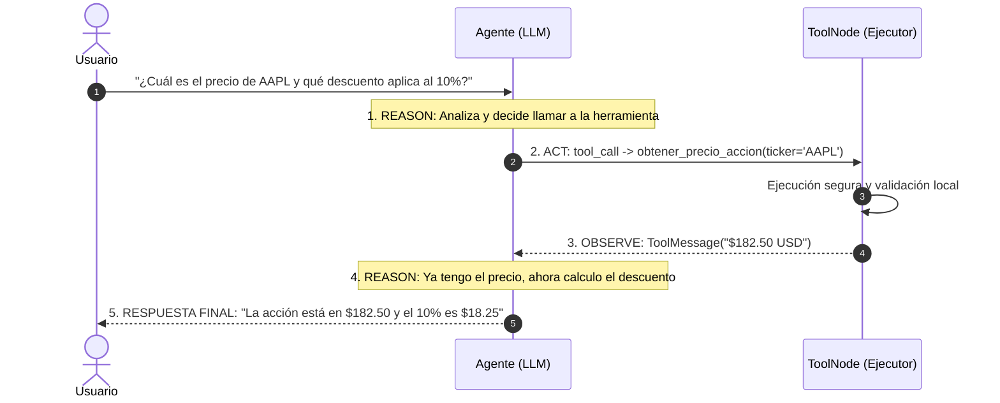

---
tags:
  - modulo-5
  - tool-calling
  - react
  - agentes
aliases:
  - Tool Calling Seguro
  - Ciclo ReAct
created: 2026-09-04
---

# 5.2 Tool Calling Seguro y el Ciclo ReAct

## 🎯 Objetivo de la Unidad
Dotar a los modelos de lenguaje de capacidades para interactuar con bases de datos, APIs y entornos de cálculo mediante contratos seguros con `@tool` y orquestar el ciclo iterativo **ReAct** (Reasoning + Acting).

---

## 1. ¿Qué es Tool Calling Realmente?

> [!NOTE]
> El LLM **nunca ejecuta código Python directamente**. En su lugar, emite un objeto estructurado (JSON) indicando qué herramienta desea invocar y con qué argumentos:
> `tool_calls: [{"name": "calcular_descuento", "args": {"monto": 1000, "tasa": 0.15}}]`.
>
> Tu backend intercepta esa intención, valida los tipos con Pydantic, corre la función localmente y le entrega el resultado al LLM en un mensaje con `role="tool"`.

---

## 2. Definición Segura de Herramientas con `@tool`

Los modelos deciden qué herramienta invocar basándose **únicamente en su nombre, docstring y esquema de tipos**:

```python
from langchain_core.tools import tool
from pydantic import BaseModel, Field

class StockInput(BaseModel):
    ticker: str = Field(description="Símbolo bursátil en mayúsculas, ej: AAPL, MSFT")

@tool(args_schema=StockInput)
def obtener_precio_accion(ticker: str) -> str:
    """Consulta el precio de una acción en tiempo real en los mercados bursátiles."""
    # Lógica de consulta a API financiera
    return f"El precio actual de {ticker} es $182.50 USD."
```

---

## 3. La Anatomía del Ciclo ReAct



---

## 4. Reglas de Seguridad en Tool Calling
* **Principio de Mínimo Privilegio**: Nunca expongas herramientas que ejecuten comandos de terminal o consultas SQL sin parametrizar.
* **Captura de Errores**: Si la API externa arroja un timeout, devuélvelo como texto legible dentro del `ToolMessage` para que el LLM pueda explicarle la situación al usuario o intentar una vía alternativa.
