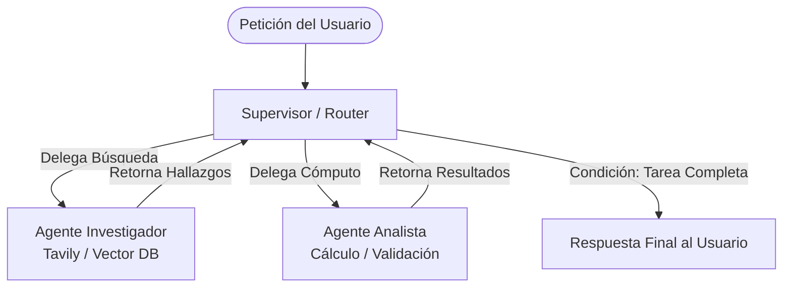

---
tags:
  - modulo-6
  - multi-agente
  - supervisor-pattern
  - jerarquia
  - colaboracion
aliases:
  - Topologías Multi-Agente
  - El Patrón Supervisor
created: 2026-09-04
---

# 6.1 Topologías Multi-Agente y el Patrón Supervisor

## 🎯 Objetivo de la Unidad
Aprender a diseñar sistemas multi-agente escalables, evaluando la disyuntiva entre **Colaboración Descentralizada** vs **Jerarquía Centralizada** e implementando el **Patrón Supervisor**.

---

## 1. El Salto del Agente Individual al Sistema Multi-Agente

Cuando un problema es demasiado complejo (ej. auditar código, planificar viajes, redactar informes con análisis financiero), un único agente se satura:
* La ventana de contexto se llena de instrucciones contradictorias.
* Dispara el fenómeno de la **"Entropía de Agentes"** (alucinaciones crecientes por exceso de herramientas y roles dispares).

---

## 2. Topología Jerárquica: El Patrón Supervisor

Inspirado en la estructura de una redacción o equipo de ingeniería: existe un **Supervisor (Director de Tráfico / Project Manager)** que delega tareas a **Agentes Especialistas (Workers)**.

### Reglas de Oro del Supervisor:
1. **El Supervisor NO ejecuta el trabajo**: Su única función es analizar el estado, decidir a qué especialista invocar y verificar si la tarea está completada.
2. **Especialización de Modelos**: Puedes usar un modelo de razonamiento superior (ej. GPT-4o) para el Supervisor, y modelos más ligeros y rápidos (ej. GPT-4o-mini o Llama-3-8B) para los Workers.
3. **Aislamiento de Escritura en el Estado**: Cada especialista solo modifica la clave de su competencia en el `AgentState` compartido para evitar colisiones.
