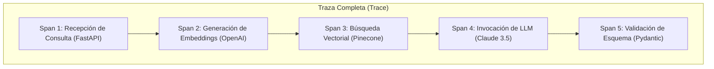

---
tags:
  - modulo-7
  - observabilidad
  - tracing
  - spans
  - arize-phoenix
  - langsmith
  - evals
aliases:
  - Observabilidad en IA
  - Trazado y Métricas de RAG
created: 2026-09-04
---

# 7.1 Observabilidad, Trazado (Spans) y Evals en RAG

## 🎯 Objetivo de la Unidad
Eliminar la opacidad en sistemas de IA pasando de la "caja negra" a la trazabilidad exhaustiva con **Arize Phoenix** o **LangSmith**, monitoreando latencia percentil, costos por token y alucinaciones.

---

## 1. El Fenómeno del "Éxito Silencioso"

En software tradicional, si algo falla se obtiene un error `500 Internal Server Error`. En IA ocurre el **éxito silencioso**:
* La API devuelve status `200 OK`.
* El texto está bien redactado y con buena ortografía.
* **Pero el modelo alucinó una cifra financiera crítica** o el retriever no trajo ningún documento relevante y el modelo inventó la respuesta.

---

## 2. Anatomía de la Observabilidad: Trazas y Spans

* **Trace**: El recorrido completo de una petición de principio a fin.
* **Span**: Cada unidad individual de trabajo jerárquica (llamada a Pinecone, inferencia del LLM, ejecución de una tool). Permite aislar con precisión qué componente causó la latencia.

---

## 3. Arize Phoenix vs. LangSmith

| Dimensión | Arize Phoenix | LangSmith |
| :--- | :--- | :--- |
| **Filosofía** | Estándar abierto, OpenTelemetry / OpenInference | Ecosistema nativo integrado de LangChain |
| **Despliegue** | Local-First (contenedor Docker o notebook) | Gestionado en la nube (SaaS) |
| **Privacidad** | Los datos nunca salen de tu infraestructura | Requiere API Key y conexión a LangChain Cloud |
| **Punto Fuerte** | Análisis profundo de embeddings y deriva (*data drift*) | Debugging interactivo de prompts y datasets de regresión |

---

## 4. La Tríada de Evaluación en RAG (Evals)
1. **Faithfulness (Fidelidad)**: ¿La respuesta se deriva **exclusivamente** de los documentos recuperados? Si responde con conocimiento propio no fundamentado en el contexto, es una alucinación.
2. **Answer Relevance**: ¿La respuesta contesta lo que el usuario preguntó?
3. **Context Precision**: ¿Los documentos que el retriever trajo eran realmente útiles para la respuesta?
