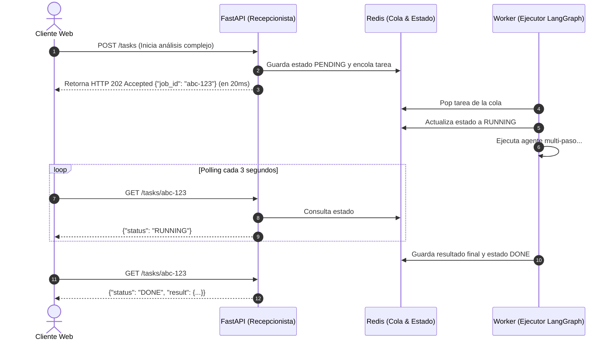

---
tags:
  - modulo-7
  - fastapi
  - redis
  - hitl
  - human-in-the-loop
  - colas-de-mensajes
  - pre-entrega
aliases:
  - FastAPI y Redis Asíncrono
  - Pre-entrega 7
created: 2026-09-04
---

# 7.2 FastAPI Asíncrono, Colas en Redis y Human-in-the-Loop

## 🎯 Objetivo de la Unidad
Desacoplar la ejecución de agentes de la respuesta HTTP mediante FastAPI y colas en Redis para absorber latencias de 30 a 120 segundos sin saturar el servidor, incorporando pausas para aprobación humana (**Human-in-the-Loop**).

---

## 1. Arquitectura Desacoplada de Procesamiento

---

## 2. Human-in-the-Loop (HITL)

En sistemas críticos (transferencias financieras, eliminación de datos, diagnósticos médicos), ningún agente debe tener autonomía total:
* **`interrupt()` en LangGraph**: El grafo detiene su ejecución en un nodo sensible y guarda el checkpoint en Redis.
* La API expone un endpoint `POST /tasks/{id}/approve` para que un operador humano revise la acción y autorice la reanudación del grafo.

---

## 📊 Rúbrica Oficial Pre-entrega 7 (Total: 100 pts | Aprobación: 70 pts)

| Criterio | Peso | Requisitos Clave |
| :--- | :---: | :--- |
| **Orquestación Asíncrona y API** | **30%** | • FastAPI con `POST /tasks` (no bloqueante, devuelve `job_id`) y `GET /tasks/{id}`. |
| **Persistencia de Estado con Redis** | **25%** | • Manejo de estados (`PENDING`, `RUNNING`, `FAILED`, `DONE`). Transición garantizada a `FAILED` si ocurre una excepción. |
| **Observabilidad y Trazado** | **20%** | • Integración activa de Phoenix o LangSmith con capturas en `/screenshots`. |
| **Intervención Humana (HITL)** | **15%** | • Nodo de aprobación que pause la ejecución hasta recibir confirmación externa. |
| **Documentación y Estructura Profesional** | **10%** | • `README.md` explicando levantamiento de Redis y API, y prueba de 5 peticiones concurrentes. |
