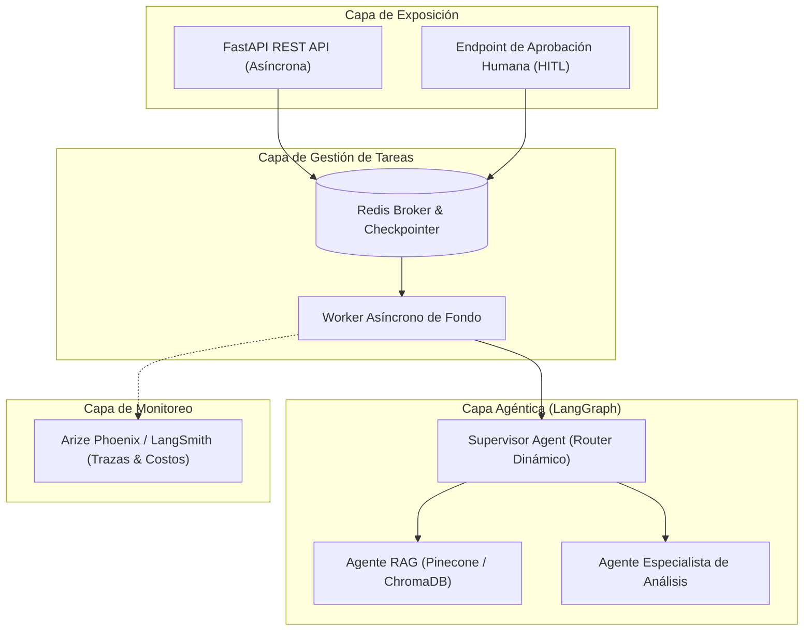

---
tags:
  - modulo-8
  - capstone
  - proyecto-integrador
  - produccion
  - rubrica-final
aliases:
  - Capstone Final
  - Sistema de Grado de Producción
created: 2026-09-04
---

# 8.1 Especificación del Capstone y Rúbrica Final

## 🎯 Qué Construir: "The Intelligence System"
Un repositorio integral en GitHub con un **Sistema de IA Completo de Grado de Producción** que integre los componentes desarrollados a lo largo de las 7 pre-entregas:

---

## 📊 Rúbrica de Evaluación Final (Total: 100 pts | Aprobación: 70 pts)

| Criterio | Peso | Requisitos Clave |
| :--- | :---: | :--- |
| **Arquitectura y Coherencia del Sistema** | **30%** | • Integración fluida de RAG, Agentes coordinados por un Supervisor y API unificada. |
| **Robustez Técnica: Asincronía y Validación** | **25%** | • Código estrictamente asíncrono con Python 3.12 y validación rigurosa de entradas y salidas con Pydantic. |
| **Persistencia y Observabilidad** | **20%** | • Checkpointers en LangGraph para recuperación de sesiones y trazabilidad completa de spans con Phoenix o LangSmith. |
| **Documentación y Despliegue** | **15%** | • `README.md` profesional con diagrama arquitectónico y despliegue local simple (`docker-compose` o `run.sh`). |
| **Configuración de Entorno y Estándares** | **10%** | • Manejo estricto de secretos (`.env`), tipado estático y modularización limpia. |
